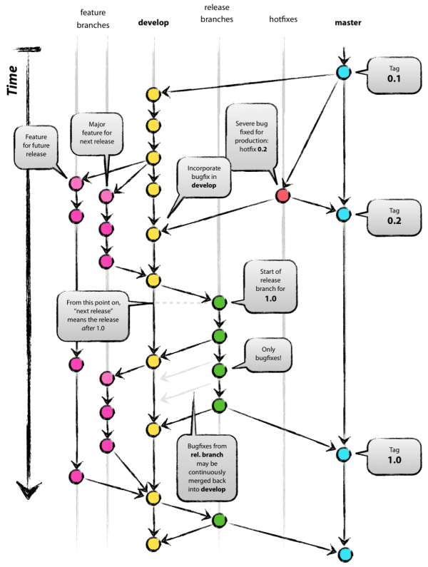

# Git 使用规范

## 写在前面

&emsp;&emsp;本文规定了本小组在开发过程中的git的操作规范。本规范若有不完善之处，望团队成员提出建议。

|版本|说明|
|:-:|:-:|
|V-1.0|确定初版git操作规范|

* 强烈建议团队成员使用[Github Desktop](https://desktop.github.com/)。在这里你能很好的获得版本信息，通过可视化界面操作分支。
* 附：[廖雪峰Git教程](https://www.liaoxuefeng.com/wiki/0013739516305929606dd18361248578c67b8067c8c017b000)
* 参考博客：[图文详解如何利用Git+Github进行团队协作开发](https://www.cnblogs.com/yhaing/p/8473746.html)

***

## 分支种类

&emsp;&emsp;本项目涉及到的主要分支类型有：

|分支类型|分支特性|分支作用|
|:-:|:-|:-|
|master分支|1.唯一的分支 2.**所有修改操作应经过组会讨论或发布公告。**|1.主分支 2.使用tag标记里程碑 3.作为发布版本公布|
|develop分支|1.命根子 2.不能直接更改该分支 3.开发过程中相对稳定的分支|1.开发分支 2.所有成员的feature分支由该分支检出 3.开发完成后用于整合feature分支 4.release分支由该分支检出|
|release分支|1.develop分支与master分支间的过度层 2.测试用的分支 3.**不能进行过多的修改**|1.发布分支 2.由develop分支检出 3.用作**发布前的测试**,进行简单的bug修复 4.bug修复比较复杂时需merge回develop分支后由其他分支修复 5.**测试完成后，需要同时merge到master和develop分支上** |
|feature分支|1.开发用的分支 2.日常工作的分支|1.功能分支 2.**用来开发新功能或进行项目维护** 3.每个人都在**自己的feature分支**上进行开发工作 4.开发完成后将此分支merge回develop分支|
|fix分支|1.临时性分支|1.补丁分支 2.**由develop分支检出** 3.用作bug修复 4.bug修复完成后**需merge回develop分支**，并**将其删除**|
|hotfix分支|1.抢救用的临时性分支 |1.热补丁分支 2.**由master分支检出** 3.用于**线上版本的bug修复** 4.基本操作类似fix分支|

* 成员维护自己的feature分支时可以将该分支视为自己的master分支，并新建自己的分支进行各种操作，但需注意命名规范。
* 注意及时删除无用的fix和hotfix类型分支，避免出现冗余的分支。
* 何为**检出**？
  * 以源分支为模板，复制出一个新分支。
  * 指令：`git checkout -b 源分支名`
* 以下为各分支间关系的图示：

***

## 分支命名规范

* 整体格式：
  * master分支：取不了名，需要用tag标记里程碑。
  * develop分支：`develop-版本号`，如：develop-v1.0
  * release分支：`release-版本号`，如：release-v1.0
  * feature分支：`feature-成员名-源分支版本号[-自定义命名]`，如：feature-Cookize-v1.0
  * fix分支：`fix-源分支版本号[-bug简述]`，如：fix-v1.0-crash
  * hotfix分支：`hotfix-源分支版本号[-bug简述]`，如：hotfix-v1.0-crash
* 个人feature分支自定义命名建议：
  * 使用小写字母
  * 自定义命名不宜过长
  * 每个单词以‘-’分隔

***

## 其他

* 不建议使用版本回退。
* 建议先**在其他仓库对涉及的git操作进行练习**，以免造成不必要的损失。