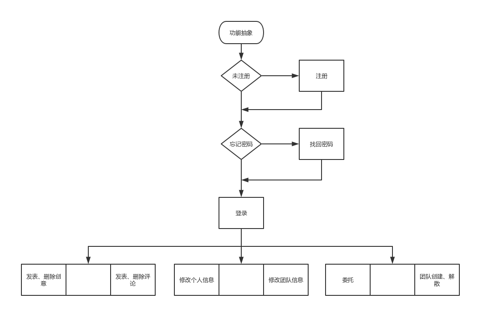
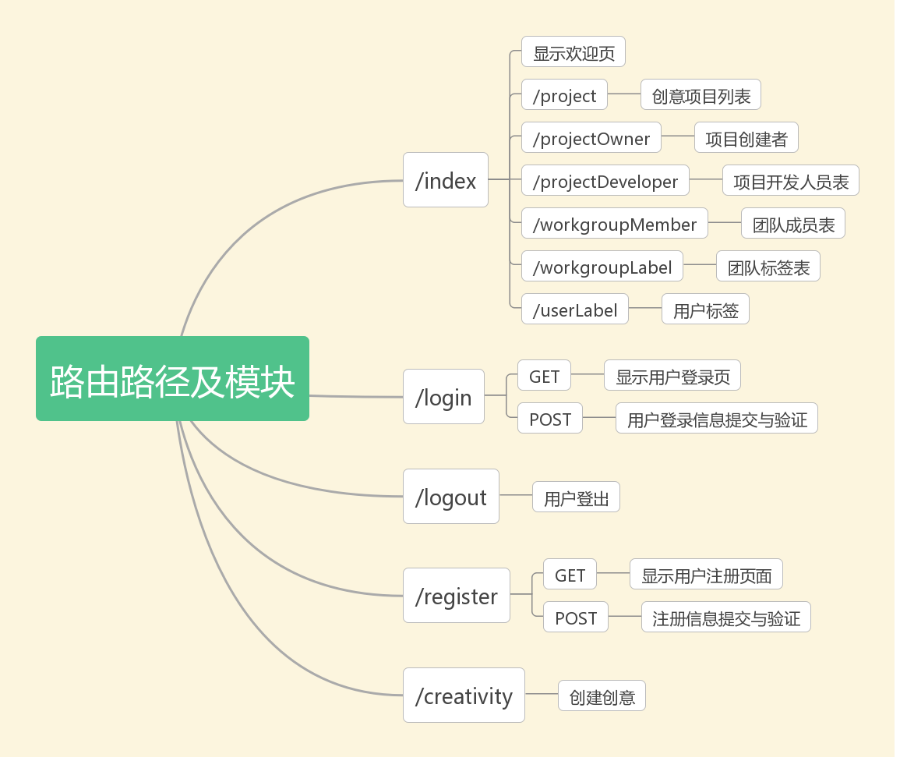
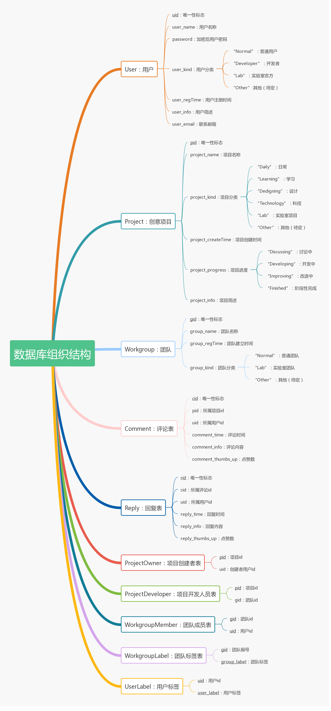
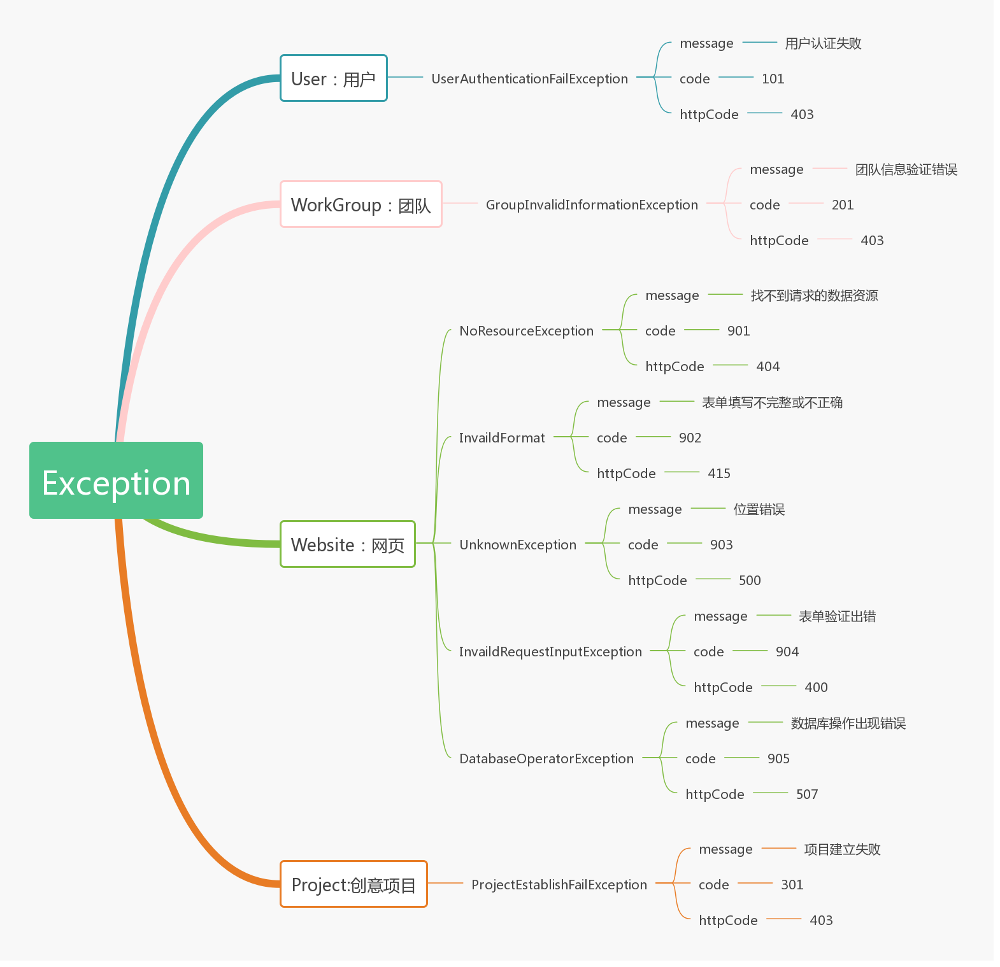

# WEDO 创意论坛技术规格说明书

## 0x0 文档版本

| 版本号 |        说明        |
| :----: | :----------------: |
|  v1.0  | 初步确定前后端逻辑 |

附Github仓库：[WEDO](https://github.com/mio4/V1-Bug)

***

## 0x1 技术说明

### 1. 前端框架

&emsp;&emsp;在主流的前端框架中，我们调研了Vue、BootStrap、AnguarJS、ReactJS等框架。每个框架都有各自的优点，但是考虑到小组成员的前端开发经验较少，最终选择了比较容易上手的**BootStrap框架**。BootStrap框架拥有很多封装好的UI组件，能够快速地搭建出优质的前端页面。

### 2. 后端框架

&emsp;&emsp;在选择编程语言的时候，抛开适合写服务器和引擎的C++以及适合高并发场景下的Go，我们讨论并分析了Java、Python、PHP三种语言，分别对应Django、SSM（Spring+SpringMVC+MyBatis）和PHP框架。
&emsp;&emsp;我们小组的开发部门有成员有使用Spring开发的经验。但是因为SSM的学习成本相对较高，需要从Servlet开始，并且一开始上手使用Hibernate或者MyBtis比较麻烦，于是排除了Java。
&emsp;&emsp;根据对PHP的调研，世界上超过80%的网站的搭建都使用到了PHP，基本上大部分论坛以及电商的网站功能，都能使用PHP7实现；另一方面看，PHP7的性能提升了很多，适合于API的开发。同时由于组里开发人员对Python后端开发以及在Django框架下的开发不熟悉，我们小组决定使用**PHP**（世界上最好的语言）作为我们小组后端的编程语言。
&emsp;&emsp;有关PHP的开发框架，经过对laravel和ThinkPHP两框架的调研后。我们初步确定最后使用**Laravel框架**。其主要原因是在Lavarel中内置了大量的API供开发者使用，在实际应用中更加贴近面向对象的开发方式。而且Laravel框架拥有大量的中文文档作为参考：[Laravel中文社区](https://learnku.com/laravel/docs)。另外，从网络安全的角度来看，Laravel更胜一筹。

***

## 0x2  服务器平台搭建

&emsp;&emsp;我们准备使用**LNMP（Linux + Ngnix + MySQL + PHP）的环境**。相较于其他服务器（如Apache），Nginx具有以下两个优点：

1. 反向代理，能够实现请求的分发，以及对于用户的后台不可见性。
2. 能够实现负载均衡。这有助于后期对于大流量用户情况的适应。

&emsp;&emsp;但是对于论坛前期的预期运行情况，还不需要考虑服务器压力和性能对于系统的影响，并且最开始只有一台可供使用的服务器。
&emsp;&emsp;对于数据库的选择，我们选择比较常用的**MySQL**。
&emsp;&emsp;考虑到服务器上并不需要桌面环境，所以开发环境预计使用**CentOS 6.x | 7.x**版本。

***

## 0x3 项目技术设计

### 项目功能抽象

&emsp;&emsp;项目的具体功能已在[*项目功能设计书*](https://github.com/mio4/V1-Bug/blob/master/docs/%E9%A1%B9%E7%9B%AE%E5%8A%9F%E8%83%BD%E8%A7%84%E6%A0%BC%E8%AF%B4%E6%98%8E%E4%B9%A6.md)中描述，以下为项目功能的初步抽象图：

### 前端界面设计

&emsp;&emsp;项目具体的前端界面设计已在[*界面设计计划书*](https://github.com/mio4/V1-Bug/blob/master/docs/%E3%80%90%E8%BD%AF%E5%B7%A5%E3%80%91%E7%95%8C%E9%9D%A2%E8%AE%BE%E8%AE%A1%E8%AE%A1%E5%88%92%E4%B9%A6.md)中进行描述。

### 后端实现设计

#### 路由路径设计

&emsp;&emsp;项目后端的路由分发路径如下图所示：

#### 数据信息存储

&emsp;&emsp;所有的数据存储至后端的MySQL数据库中。数据在数据库的组织方式如下图所示：

&emsp;&emsp;各数据的详细类型及规定如下表所示：

<table>
<tr>
    <th>数据表名</th>
    <th>属性名</th>
    <th>属性类型</th>
    <th>是否为主属性</th>
</tr>
<tr>
    <th rowspan = "7">User</th>
    <td>uid</td>
    <td>int(8)</td>
    <td>Yes</td>
</tr>
<tr>
    <td>user_name</td>
    <td>varchar(32)</td>
    <td></td>
</tr>
<tr>
    <td>password</td>
    <td>varchar(256)</td>
    <td></td>
</tr>
<tr>
    <td>user_kind</td>
    <td>int(8)</td>
    <td></td>
</tr>
<tr>
    <td>user_regTime</td>
    <td>timestamp</td>
    <td></td>
</tr>
<tr>
    <td>user_email</td>
    <td>varchar(32)</td>
    <td></td>
</tr>
<tr>
    <td>user_info</td>
    <td>varchar(128)</td>
    <td></td>
</tr>
<tr>
    <th rowspan="6">Project</th>
    <td>pid</td>
    <td>int(8)</td>
    <td>Yes</td>
</r>
<tr>
    <td>project_name</td>
    <td>varchar(32)</td>
    <td></td>
</tr>
<tr>
    <td>project_kind</td>
    <td>int(8)</td>
    <td></td>
</tr>
<tr>
    <td>project_createTime</td>
    <td>timestamp</td>
    <td></td>
</tr>
<tr>
    <td>project_progress</td>
    <td>int(4)</td>
    <td></td>
</tr>
<tr>
    <td>project_info</td>
    <td>varchar(512)</td>
    <td></td>
</tr>
<tr>
    <th rowspan="4">Workgroup</th>
    <td>gid</td>
    <td>int(8)</td>
    <td>Yes</td>
</r>
<tr>
    <td>group_name</td>
    <td>varchar(32)</td>
    <td></td>
</tr>
<tr>
    <td>group_regTime</td>
    <td>timestamp</td>
    <td></td>
</tr>
<tr>
    <td>group_kind</td>
    <td>int(8)</td>
    <td></td>
</tr>
<tr>
    <th rowspan="6">Comment</th>
    <td>cid</td>
    <td>int(8)</td>
    <td>Yes</td>
</r>
<tr>
    <td>pid</td>
    <td>int(8)</td>
    <td></td>
</tr>
<tr>
    <td>uid</td>
    <td>int(8)</td>
    <td></td>
</tr>
<tr>
    <td>comment_time</td>
    <td>timestamp</td>
    <td></td>
</tr>
<tr>
    <td>comment_info</td>
    <td>varchar(256)</td>
    <td></td>
</tr>
<tr>
    <td>comment_thumbs_up</td>
    <td>int(8)</td>
    <td></td>
</tr>
<tr>
    <th rowspan="6">Reply</th>
    <td>rid</td>
    <td>int(8)</td>
    <td>Yes</td>
</r>
<tr>
    <td>cid</td>
    <td>int(8)</td>
    <td></td>
</tr>
<tr>
    <td>uid</td>
    <td>int(8)</td>
    <td></td>
</tr>
<tr>
    <td>reply_time</td>
    <td>timestamp</td>
    <td></td>
</tr>
<tr>
    <td>reply_info</td>
    <td>varchar(256)</td>
    <td></td>
</tr>
<tr>
    <td>reply_thumbs_up</td>
    <td>int(8)</td>
    <td></td>
</tr>
<tr>
    <th rowspan="2">ProjectOwner</th>
    <td>pid</td>
    <td>int(8)</td>
    <td>Yes</td>
</r>
<tr>
    <td>uid</td>
    <td>int(8)</td>
    <td></td>
</tr>
<tr>
    <th rowspan="2">ProjectDeveloper</th>
    <td>pid</td>
    <td>int(8)</td>
    <td>Yes</td>
</r>
<tr>
    <td>gid</td>
    <td>int(8)</td>
    <td></td>
</tr>
<tr>
    <th rowspan="2">WorkgroupMember</th>
    <td>gid</td>
    <td>int(8)</td>
    <td>Yes</td>
</r>
<tr>
    <td>uid</td>
    <td>int(8)</td>
    <td>Yes</td>
</tr>
<tr>
    <th rowspan="2">UserLabel</th>
    <td>uid</td>
    <td>int(8)</td>
    <td>Yes</td>
</r>
<tr>
    <td>user_label</td>
    <td>int(8)</td>
    <td>Yes</td>
</tr>
<tr>
    <th rowspan="2">WorkgroupLabel</th>
    <td>gid</td>
    <td>int(8)</td>
    <td>Yes</td>
</r>
<tr>
    <td>group_label</td>
    <td>int(8)</td>
    <td>Yes</td>
</tr>
</table>

### 异常处理

&emsp;&emsp;目前，系统中预期中的各个部分异常如下图所示：

